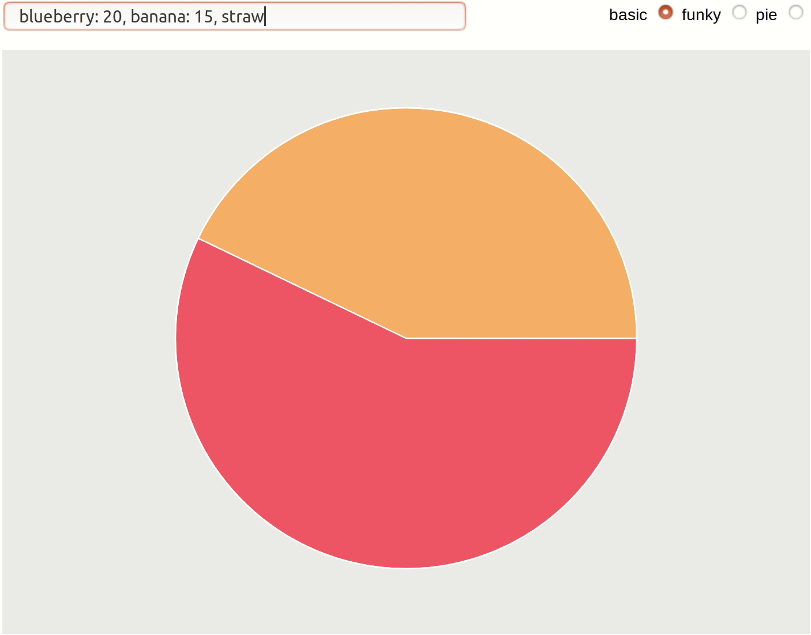

# Pie Chart Maker

This is my entry in [Phoenix Phrenzy](https://phoenixphrenzy.com), showing off what [Phoenix](https://phoenixframework.org/) and [LiveView](https://github.com/phoenixframework/phoenix_live_view) can do.

A Pie Chart Maker with several predefined styles and an option to define custom styles for the items.

The pie slices are generated as _SVG paths_.

## Try it online
**[Pie Chart Maker Demo](http://cernaovec.gigalixirapp.com/piechart)**

## How to use

Edit the input and the application will automatically recalculate the percents and update the chart.

## Switch between 3 styles

- **basic:** 36 predefined basic colors.
- **funky:** Random selection of funky colors.
- **pie:** :-)   Items use specific styles predefined in  _.css_.  

## The Pie style :-)

Item's name == name of a _.css_ class.  
So you can easily define custom styles for the items. (Edit `/assets/css/app.css` file. Add the custom classes at the end of the file, after the default ones, for this to work.)  

If there is no predefined style for the item, it will have one of the basic colors.

Currently there are a few predefined styles: _strawberry, banana, blueberry, kiwi_ etc. 

They use SVG patterns, for example:  
`.strawberry {fill: url("#strawberry");}`

The patterns are defined in `/templates/page/piechart_patterns.html.leex`.

## The Usual README Content

To start your Phoenix server:

  * Install dependencies with `mix deps.get`
  * Install Node.js dependencies with `cd assets && npm install`
  * Start Phoenix endpoint with `mix phx.server`

Now you can visit [`localhost:4000`](http://localhost:4000) from your browser.

Ready to run in production? Please [check our deployment guides](https://hexdocs.pm/phoenix/deployment.html).

## Learn more

  * Official website: http://www.phoenixframework.org/
  * Guides: https://hexdocs.pm/phoenix/overview.html
  * Docs: https://hexdocs.pm/phoenix
  * Mailing list: http://groups.google.com/group/phoenix-talk
  * Source: https://github.com/phoenixframework/phoenix
